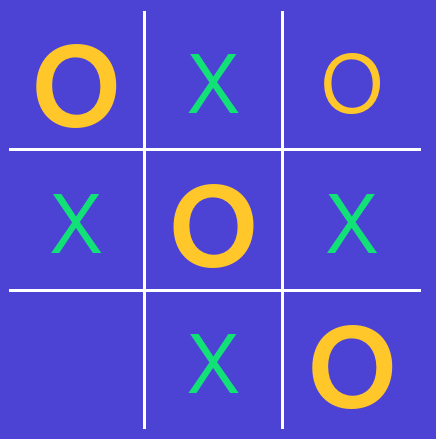
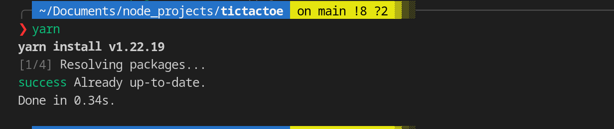
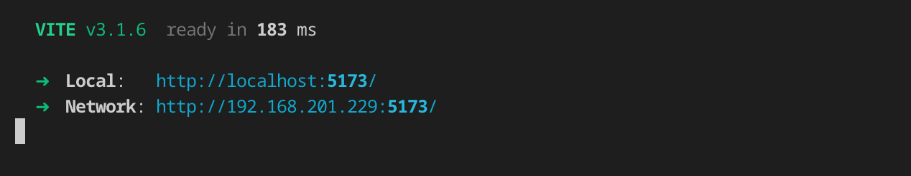
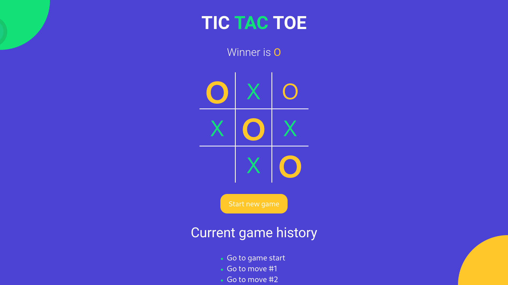

  

<!-- PROJECT LOGO -->
<br />
<div align="center">
  <a href="https://gauravs-tic-tac-toe.surge.sh">
    
  </a>
  
  <h3 align="center"><b>tic tac toe</b></h3>

  <p align="center">
    This is tic tac toe game, which is created on the react js library. This is single page game(SPG) and feels like a desktop app.
    <br />
    <a href="#"><strong>Explore the docs »</strong></a>
    <br />
    <br />
    <a href="https://gauravs-tic-tac-toe.surge.sh" style="color:orange; font-weight:bold">Play Now!!</a>
    ·
    <a href="https://github.com/gv211432/tictactoe/issues">Report Bug</a>
    ·
    <a href="https://github.com/gv211432/tictactoe/issues">Request Feature</a>
  </p>
</div>

<!-- ABOUT THE PROJECT -->

## ☑️ About The Project

<br>


<br>

If tic-tac-toe were as simple as it seems, why has it been around for over 3,000 years? The version has evolved a bit since the original version in ancient Egypt, by letting kids play against the computer. However, what it teaches kids hasn’t changed. This classic game contributes to children’s developmental growth in numerous ways including their understanding of predictability, problem solving, spatial reasoning, hand-eye coordination, turn taking, and strategizing. Teachers trust Toy Theater to provide safe & effective educational games. Free to play, priceless to learn.

This project is developed by [me](https://github.com/gv211432).

<br>

## ⚙️ Installation

### 1. Clone this repository

```js
git clone https://github.com/gv211432/tictactoe.git
```

### 2. Open the directory `tictactoe`

```
cd tictactoe
```

### 3. run the command `yarn` or `npm install`



### 4. Finally start the game by runnign command `yarn start` or `npm start`



### 5. Congrats!!



<p align="right">(<a href="#top">back to top</a>)</p>

## 📖 License

Licence details are given here.
[MIT](https://github.com/gv211432/tictactoe/blob/main/LICENSE)
